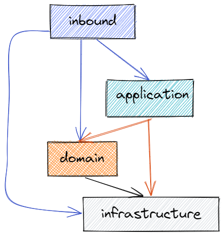

# demo_springboot

> 此 demo项目主要是集成了基础模块的spring boot模板项目，主要目的：

1. 提供一个快捷开发的模板项目
2. 定义了工程结构、代码实现的标准
3. 实现了一些基础功能，如：认证、权限、定时任务、日志、配置等
---
## 开发环境

* JDK 1.8+
* Maven 3.5+
* IntelliJ IDEA ULTIMATE 2018.2 + (保证安装 lombok 插件)
* Mysql 5.7 +
---
## 1. 运行程序

* 在idea中打开项目，运行程序

1. clone项目

```shell
git clone https://github.com/henuzfl/demo_springboot.git
```

2. 使用idea打开项目
3. 新建数据库
4. 修改配置文件的数据库配置
5. 运行程序

* 使用maven打包运行

1. 修改配置文件的数据库配置
2. maven打包

```shell
mvn clean package -DSkipTests
```

3. 运行程序

```shell
java -jar target/demo_springboot-1.0-SNAPSHOT.jar
```

* 使用docker运行

1. 在有安装docker的机器上运行

```shell
mvn clean package -DSkipTests docker:build
```

2. 运行程序

```shell
docker run -p 8080:8080 -d --name demo_springboot demo/demo_sprintboot:dev-1.0-SNAPSHOT
```

运行成功后，可以在浏览器中访问：http://localhost:8080/doc.html

---
## 2. 工程结构

参考了DDD以及六边形架构的分层模式以及设计原则， 整体分为以下：


* inbound: 入站适配器：包括：实现RESTFul结构的controller以及订阅消息的listener。
* Application：对应DDD中的Application层，
  主要是协调多个domain或者有其他业务逻辑之外的操作（比如执行完业务逻辑之后发送邮件通知）；负责定义软件本身对外暴露的能力，即软件本身可以完成哪些任务，并负责对内协调领域对象来解决问题。Application层都会被选为包裹事务（代码进入此层事务开始，退出此层事务提交或者回滚）的载体。
* Domain：对应DDD中的Domain层，负责实现业务逻辑，即表达业务概念，处理业务状态信息以及业务规则这些行为，此层是整个项目的重点。
* Infrastructure：类似于DDD中的Infrastructure层，向其他层提供通用的技术能力，譬如缓存、日志、认证、远程服务通讯、工具集，等等。

## 3. 技术选型以及关键模块

### 1. 技术选型

* 基础架构：spring boot
* 缓存：caffeine
* orm：jpa
* 安全：基于spring security的jwt
* 定时任务：quartz
* 数据库脚本管理：flyway
* 接口日志：knife4j
* 进程内观察者模式：guava的eventbus

### 2. auth模块

### 3. 
